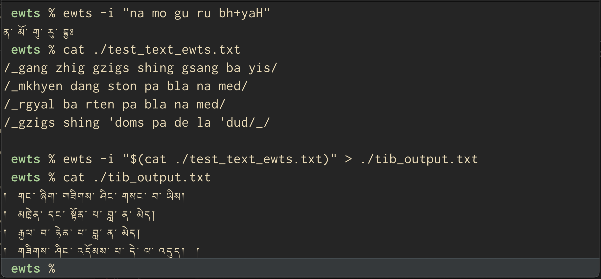

# ewts-cli

[](https://crates.io/crates/ewts-cli)

CLI tool to convert text from EWTS (Extended Wylie Transliteration Scheme) to Tibetan Unicode symbols

Fully compliant with the standard. See all rules on
[The Tibetan and Himalayan Library's site](https://www.thlib.org/reference/transliteration/#!essay=/thl/ewts/rules/) 
and tests on them here in [rules_test.rs](https://github.com/emgyrz/ewts-rs/blob/master/ewts/src/rules_test.rs) file.

It is part of set of apps/libs called **ewts-rs**.
See more [here](https://github.com/emgyrz/ewts-rs)


#### Example:
```sh
$ ewts --input "bkra shis bde legs/"
# བཀྲ་ཤིས་བདེ་ལེགས།

$ ewts --help
# ...
# Usage: ewts [OPTIONS] --input <INPUT>
# 
# Options:
#   -s, --source-type <SOURCE_TYPE>  Type of input symbols [default: ewts] [possible values: ewts, unicode]
#   -i, --input <INPUT>              String to convert
#   -h, --help                       Print help
#   -V, --version                    Print version

# to convert file:
$ ewts -i "$(cat /path/to/your/file.txt)"
```


#### Usage
[](../assets/ewts-cli.mp4)


#### Installation
For now only with
```sh
cargo install ewts-cli
```

